# Standard MeshPack (.meshpack)

The official specification, schemas, and tooling for the **MeshPack** format — a universal, portable container for 3D assets, metadata, and cross-platform indices.

## Introduction

The `.meshpack` format is a standardized container format used within the Mesh-Sync ecosystem to represent a snapshot of a file system or a collection of 3D assets. It serves as an intermediate data structure for synchronization, allowing the decoupling of the "Scanning" phase from the "Processing" phase.

This format is designed to be:
- **Portable**: Can be moved across systems (with platform metadata).
- **Scalable**: Supports massive file counts via index sharding.
- **Verifiable**: Includes hashing for integrity with detached `.meshpack.integrity` sidecar files.
- **Extensible**: Designed with forward-compatibility for future versioning.

MeshPack (`.meshpack`) is a ZIP-based container format designed to solve the fragmentation in 3D asset management. It bundles:
- **3D Models**: STL, OBJ, 3MF, etc. (deduplicated via content addressing).
- **Metadata**: Rich JSON manifest with licensing, creator info, and platform compatibility.
- **Indices**: Sharded search indices for fast local access without unpacking.
- **Portability**: Self-contained "files" that act like databases.

## Visual Overview



MeshPack is the handoff object between provider-specific storage discovery and provider-agnostic processing. Storage connectors create a deterministic archive, validators prove integrity and conformance, and downstream workers or importers can operate without re-learning the source storage system. The Mermaid source for this diagram lives at [docs/assets/meshpack-architecture.mmd](docs/assets/meshpack-architecture.mmd), and the design rationale is expanded in [Designing MeshPack: How Standards Emerge from Real 3D Model Workflows](http://127.0.0.1:4322/blog/designing-meshpack-standard/).

## Repository Structure

- **[`definition/`](definition/README.md)**: The human-readable specification (RFC-style). **Start here.**
- **[`schema/`](schema/)**: Canonical JSON Schemas used for validation and code generation.
  - `manifest.schema.json`, `shard.schema.json`, `sidecar.schema.json`, `common.schema.json`
  - `extensions/` — versioned extension schemas:
    `meshsync_geometry`, `meshsync_printability`, `meshsync_dependencies`, `meshsync_content`, `meshsync_thumbnails`
- **[`generators/`](generators/)**: Python scripts and Jinja2 templates that generate client libraries from the schemas for Python, Rust, TypeScript, and Java 17+.
- **[`tools/`](tools/)**: Standalone tools (`meshpack_validate.py` — archive validator with JSON Schema modes, JCS, signature, and path/resource safety checks).
- **[`tests/conformance/`](tests/conformance/)**: Conformance test suite (L1/L2/L3) with static fixture archives.
- **[`tests/sdk_validation_vectors.json`](tests/sdk_validation_vectors.json)**: Shared validation vectors consumed by generated SDK tests.
- **[`samples/`](samples/)**: Example manifest and shard JSON files.
- **[`docs/`](docs/)**: Release, schema hosting, conformance, validation, SDK quickstart, and additional reference documents.
- **[`generated/`](generated/)**: (Gitignored) The output directory for generated SDKs.

## Usage

This repository uses [`just`](https://github.com/casey/just) for task automation.

### Prerequisites
- **Python 3.10+** (for generators)
- **Node.js/npm** (for TypeScript SDK build)
- **Rust/Cargo with Clippy** (for Rust SDK build and lint)
- **JDK 17 + Maven** (for Java SDK build)
- **Just** (`curl --proto '=https' --tlsv1.2 -sSf https://just.systems/install.sh | bash -s -- --to ~/bin`)

### Commands

| Command | Description |
|---------|-------------|
| `just provision` | Bootstraps a clean checkout: installs Python tooling, generates SDKs with authoritative locks, then fetches Rust, TypeScript, and Java dependencies. This network-capable step is never part of a quality profile. |
| `just generate` | Generates SDK code for Python, Rust, TypeScript, and Java 17 into `generated/sdks/`. |
| `just check-locks` | Verifies generated Cargo and npm locks are byte-identical to their tracked authoritative inputs under `generators/locks/`. |
| `just check-version` | Verifies all generated package versions match `VERSION`. |
| `just determinism-check` | Runs generation twice and verifies generated source output is byte-identical. |
| `just artifact-hygiene` | Scans public samples and generated package roots for secrets, private-key files, missing package metadata, and public sample privacy issues. |
| `just check-clean` | Fails when tracked or non-ignored untracked files changed during generation or release checks. |
| `just validate` | Validates all JSON schemas against the meta-schema and strict-validates the public sample archive. |
| `just compile` | Builds the generated SDKs (Python wheel, Rust crate, NPM package, Maven package). |
| `just lint` | Runs generator lint plus generated Rust, TypeScript, and Java compile checks. |
| `just test` | Runs Python tests and generated Rust, TypeScript, and Java test/build gates. |
| `just quality-fast` | Validates and checks all four SDK languages using only pre-provisioned local dependencies and offline/locked package-manager modes. |
| `just quality-full` | Adds deterministic generation, artifact hygiene, and package version checks. |
| `just quality-release` | Adds offline compilation and package inspection to the full profile; never uploads packages. |
| `just package-artifacts` | After `just publish-dry-run`, materializes npm and Cargo archives alongside the built Python and Java packages without publishing. |
| `just all` | Runs generate, validate, lint, test, and compile. |
| `just public-readiness` | Runs the full dry-run gate, artifact hygiene, and clean-worktree checks for public exposure. |
| `just clean` | Removes the `generated/` directory. |

## SDKs

The generator produces strongly-typed client libraries for core MeshPack reading and writing. The Python reference validator remains the source of truth for full conformance checks until each SDK reaches validator parity.

- **Python**: Pydantic models with `zipfile` abstraction.
- **Rust**: Serde structs with `zip` crate integration.
- **TypeScript**: Typed interfaces with `jszip`, archive read/write helpers, entry hashing, validation, and model-entry listing.
- **Java 17+**: Records/enums with Jackson JSON property mapping and a ZIP reader packaged with Maven.

All generated SDK readers reject non-canonical `resource_ref` / `preview_ref` values before resolving `resources/<name>`. The generated Python, Rust, TypeScript, and Java validators support SHA-2 and BLAKE3 `entries_hash` verification, detached sidecar hash checks, and Ed25519/RSA-PSS-SHA256 sidecar signature verification hooks.

## Validation

The reference validator runs both structural checks and JSON Schema validation:

```bash
python3 tools/meshpack_validate.py sample.meshpack --schema-mode strict
```

`compat` mode is the default and reports unknown schema properties as warnings for forward-compatible inspection. `strict` mode treats unknown properties as errors and is the recommended release gate.

Archive `format_version` values use canonical `MAJOR.MINOR.PATCH` only. Requirement evidence is tracked in [docs/REQUIREMENT_COVERAGE.md](docs/REQUIREMENT_COVERAGE.md), with explicit notes where L3 behavior is owned by consuming ecosystem implementations rather than this schema/SDK package.

## Contributing

1.  **Modify the Spec**: Edit `definition/README.md`.
2.  **Update Schemas**: Edit `schema/*.json`.
3.  **Update Generators**:
    *   Logic: `generators/generate_sdks.py`
    *   Templates: `generators/templates/`
4.  **Regenerate**: Run `just generate` to verify your changes produce valid code.
5.  **Test**: Run `just all` to ensure schemas, generators, conformance fixtures, and all generated SDKs build.

See [docs/SDK_QUICKSTARTS.md](docs/SDK_QUICKSTARTS.md), [docs/VALIDATION_CONTRACT.md](docs/VALIDATION_CONTRACT.md), and [docs/SCHEMA_HOSTING.md](docs/SCHEMA_HOSTING.md) for public integration details.
